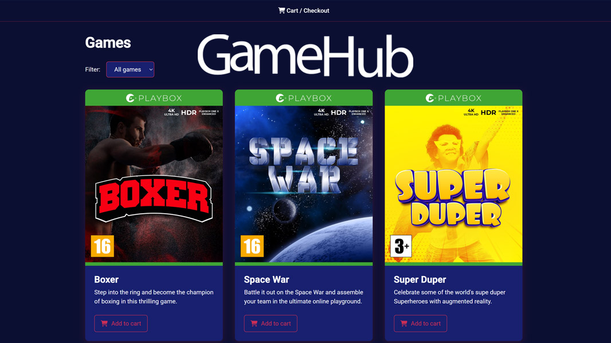

# Gamehub

- [Site](http://)

Noroff's "JavaScript 1". The assignment is to build an interactive store built with HTML, CSS and JavaScript (only) using a provided API.

Features:

- API-driven product list
- Genre filter
- Product detail
- Cart (localStorage)
- Checkout summary
- Order confirmation

More adjustments and improvements will be made over time. The intention is to learn the core/fundamental technologies of frontend development.

To run: Open `index.html` with a local server (VS Code Live Server).

  
